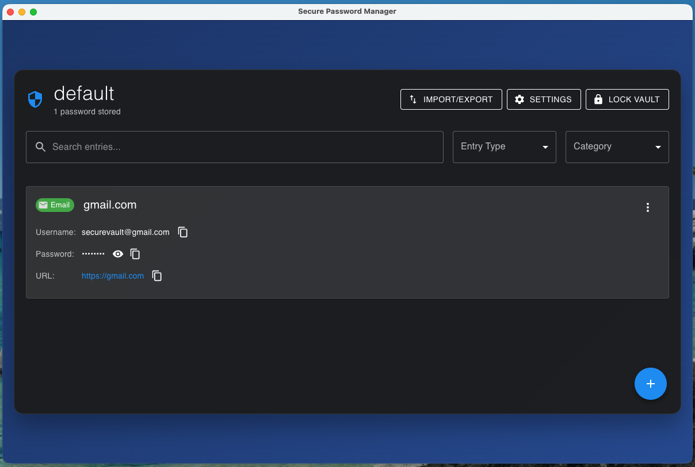
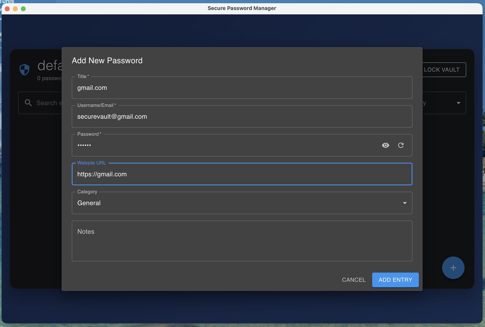

# Desktop app — install & first vault

The SecureVault desktop app is a cross-platform password manager (macOS, Windows,
Linux) built on Electron. It stores your logins in encrypted vaults and shares
those vaults with the [CLI](/guide/cli/).

  
  

## Install

Download the build for your platform from the
[**Releases page**](https://github.com/benzid-wael/secure-vault/releases/latest):

| OS          | Download                                         |
| ----------- | ------------------------------------------------ |
| **macOS**   | `.dmg` (installer) or `.zip` (portable)          |
| **Windows** | `*-Setup.exe` (installer) or portable `.exe`     |
| **Linux**   | `.AppImage` (portable) or `.deb` (Debian/Ubuntu) |

::: warning First launch on an unsigned build
The app is not yet code-signed, so your OS will warn that the developer is
unidentified — this is expected.

- **macOS** — right-click the app → **Open** → **Open** (first time only), or run
  `xattr -dr com.apple.quarantine "/Applications/Secure Password Manager.app"`.
- **Windows** — click **More info** → **Run anyway** on the SmartScreen prompt.
- **Linux (AppImage)** — `chmod +x Secure*.AppImage`, then run it.
  :::

## First-time setup

1. Launch the application.
2. You'll see the **vault selector** with a default vault.
3. The default vault password is `changeme123`.
   ::: danger Change this immediately
   The default password exists only so you can get in on first launch. Create your
   own vault with a strong master password, or change the default's password right
   away.
   :::

## Create a new vault

1. Click **Create New Vault** from the main screen.
2. Enter a unique vault name.
3. Create a strong master password — the app shows a live **password-strength**
   meter as you type.
4. Confirm your password.
5. Click **Create Vault**.

::: tip Your master password is never stored
SecureVault is zero-knowledge. If you forget the master password, the vault cannot
be recovered — choose something long, unique, and memorable.
:::

## Unlock a vault

Select the vault in the vault selector and enter its master password. The vault
stays unlocked while the app is open; lock it (or quit) when you step away.

## Next

- [**Managing passwords**](/guide/gui/managing-passwords) — add, search, copy, edit, delete.
- [**Security & best practices**](/guide/gui/security) — how encryption works and how to stay safe.
